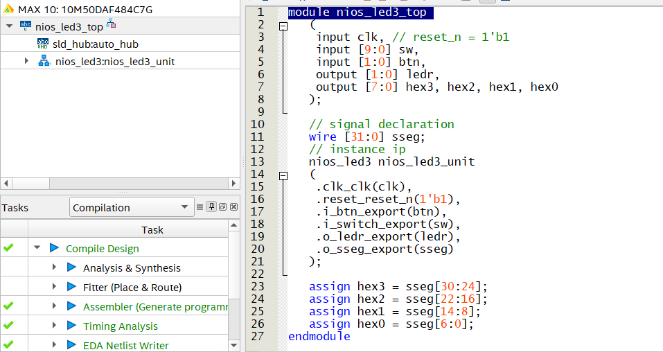

# Giới thiệu
Xây dựng một SOPC đơn giản trên FPGA sử dụng softcore NIOSII phát triển bởi Altera. Hệ thống điều khiển thời gian nhấp nháy của hai bóng đèn LED
và hiển thị thời gain trên các thanh LED 7 đoạn. Nội dung công việc gồm hai phần chính:
<ul>
  <li>Xây dựng phần cứng bằng Verilog HDL.</li>
  <li>Xây dựng device driver và application bằng ngôn ngữ lập trình C.</li>
</ul>

# Hệ thống
## Các thành phần
<ul>
  <li>JATG UART để tạo kết nối nối tiếp đến console.</li>
  <li>Hai timer, một cho system task, một cho user application.</li>
  <li>Input port cho 10 switch.</li>
  <li>Input port cho hai nút nhấn hoạt động theo sườn xuống.</li>
  <li>Output port cho hai led đơn nhấp nháy.</li>
  <li>Output port cho 4 thanh led 7 đoạn.</li>
</ul>

## Hoạt động
<ul>
  <li>Cài đặt thời gian nhấp nháy cho hai led bằng 10 switch. Nhấn nút để nạp</li>
  <li>Có thể dừng nhấp nháy bằng cách nhấn nút. Để tiếp tục nhấn nút lần hai.</li>
  <li>3 thanh LED 7 đoạn hiển thị thời gain được cài đặt, 1 thanh còn lại hiển thị P(pause) hoặc tắt(not pause).</li>
  <li>Hiển thị thời gain được cài đặt trên màn hình console của máy tính mỗi khi thay đổi.</li>
</ul>

## Xây dựng phần cứng
### Platform design để cấu hình các module
Chi tiết trong file cấu hình <a href="nios_led3/nios_led3.qsys">nios_led3.qsys</a>

  
  

### Top module

  

Cấu hình các cổng vào ra trong <a href="nios_led3_pin_assigment.csv">nios_led3_pin_assigment.csv</a>

## Xây dựng phần mềm
Trong [nios_led3/software](nios_led3/software) gồm các thư mục <a href="nios_led3/software/led3_bsp">led3_bsp</a> chứa các thông tin về board phục vụ phát triển phần mềm.
Các thư mục test còn lại chứa các file driver và chương trình test. Trong đó <a href="nios_led3/software/led3_test_isr">led3_test_isr</a> sử dụng ngắt với "context", 
<a href="nios_led3/software/led3_test_isr_v2">led3_test_isr_v2</a> sử dụng ngắt với global variables.

## Demo

  

## Các công cụ
<ul>
  <li>Quartus prime lite</li>
  <li>Nios II</li>
  <li>DE10-Lite (MAX10 10M50DAF484C7G)</li>
</ul>

  

## Cài đặt
Tham khảo: [https://youtu.be/XprMl1q_Srk?si=1r7ImX1thikUSuKd](https://youtu.be/XprMl1q_Srk?si=1r7ImX1thikUSuKd)

